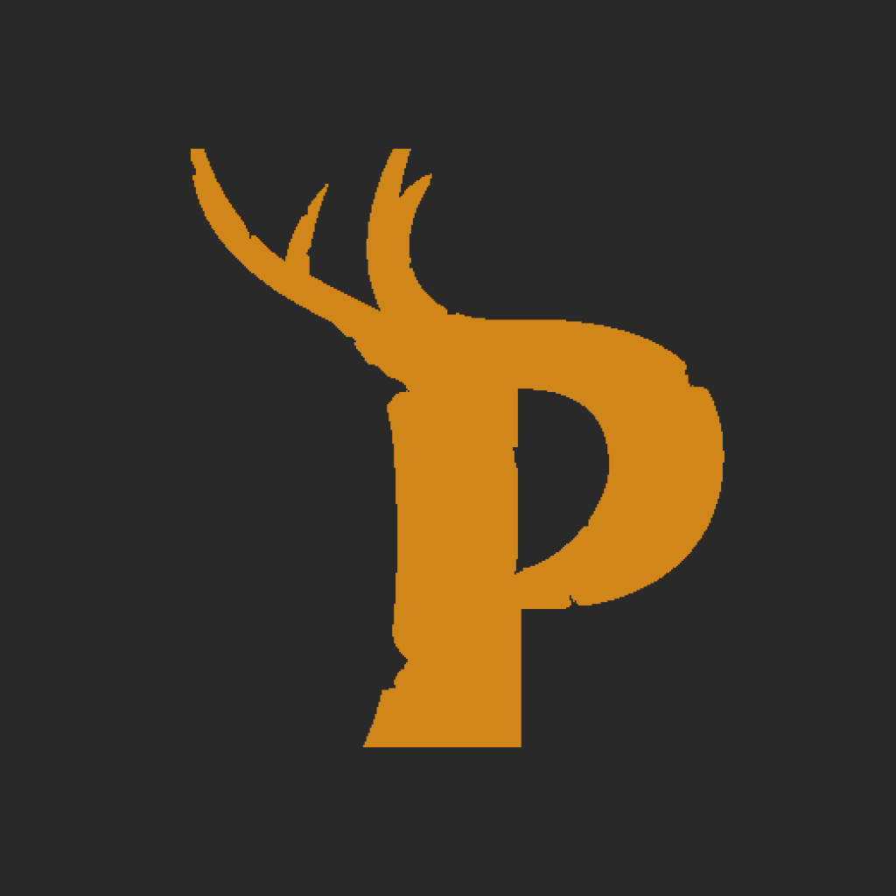
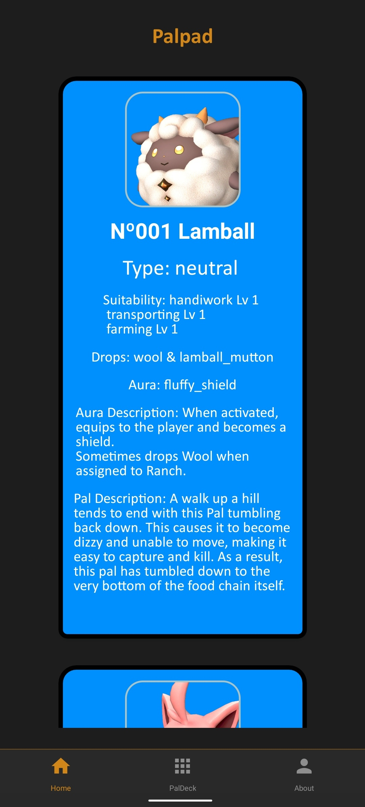
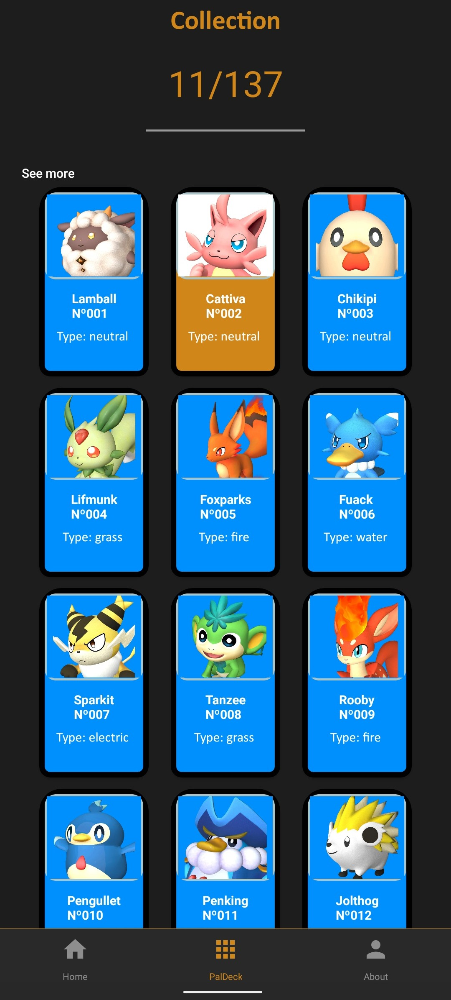

# PalPad

    <h1 align="center">
    
    </h1>

  
  

  

  
  
  
  

## Preview

    
    

## Goal
This little project has the goal of only show the pals of the game **Palworld** which was released on early acess on January of 2024, this game has quickly become an worldwide sucess since then so i decided to develop this app to bring more information to the players about the game and its monsters in the most pratical way possible.

## Development
This project has made using React Native with Expo SDK Version 50, also with Javascript and using the fetch method to obtain information of an api developed by Victor Eyer all api credits goes to him here is the link for the api respository (https://github.com/mlg404/palworld-paldex-api).

## Disclaimer
The game **Palworld** is a survival and monster taming/creature collection, the objective is survival in an hostile world with the creatures that you as the player encounter on your journey those creatures have several functions to help the players in many ways, the game is currently avaiable on PC, Xbox Consoles (Xbox Game Pass) all rights on the brand belongs to the company PocketPair which is the developer and publisher of the game and this project does not intend to make money on their brand.  

## Build instructions

This project uses: 
Node version **20.5.1** and Expo SDK version **54**

1. Run the command **npm install** ou **yarn install** to install all the necessary packages
2. Run the command **npm start** ou **yarn start** 